# BarAI

BarAI is a Flutter chat and menu app for a cocktail bar with three login modes: customer, bartender, and admin.

## Features

- Customer browsing for cocktails and mocktails
- Bartender AI-assisted recipe creation using Groq
- Save AI-generated recipes with a name suggestion
- Admin management for bartenders and drinks
- Light, dark, and system theme switching
- Drink images and responsive cards

## Running locally

1. Install Flutter.
2. Run `flutter pub get`.
3. Start the app with `flutter run`.

## Default demo accounts

- Customer: `customer@bar.com` / `cust123`
- Bartender: `bartender@bar.com` / `bar123`
- Admin: `admin@bar.com` / `admin123`

## Groq API key

Add your Groq API key from the in-app API key dialog. The key is stored locally on the device.

## Theme switching

Use the theme button in the top bar to switch between:

- System theme
- Light theme
- Dark theme

# 📸 Screenshots

## 👤 Customer

### Login Screen
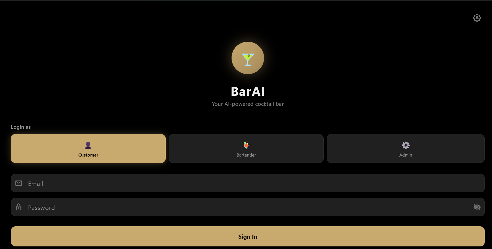

### Customer Menu
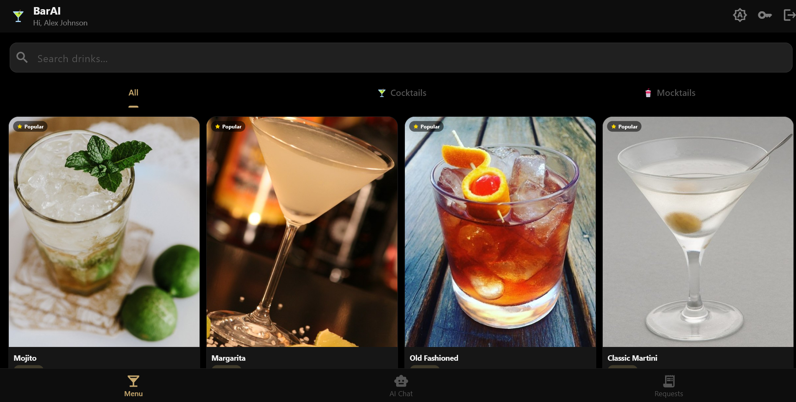

### Cocktail Menu
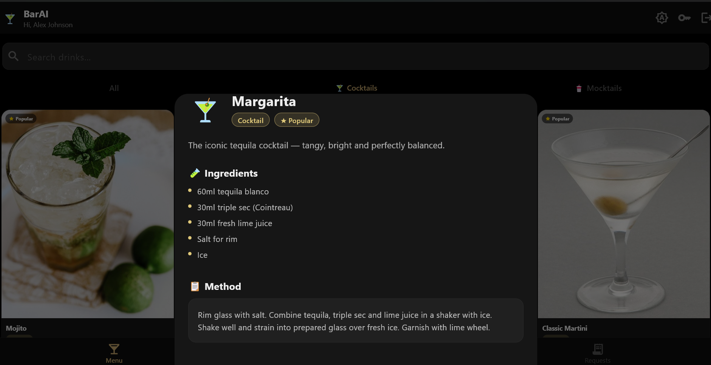

### AI Drink Recommendation
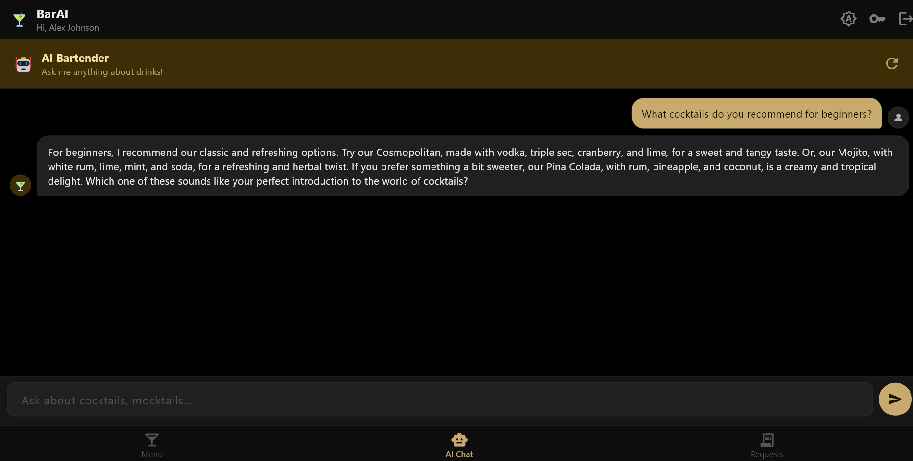

### Customer Request
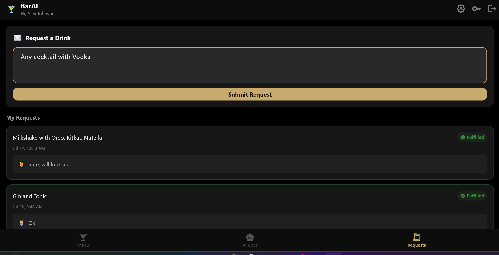

---

## 👨‍🍳 Bartender

### Bartender Menu
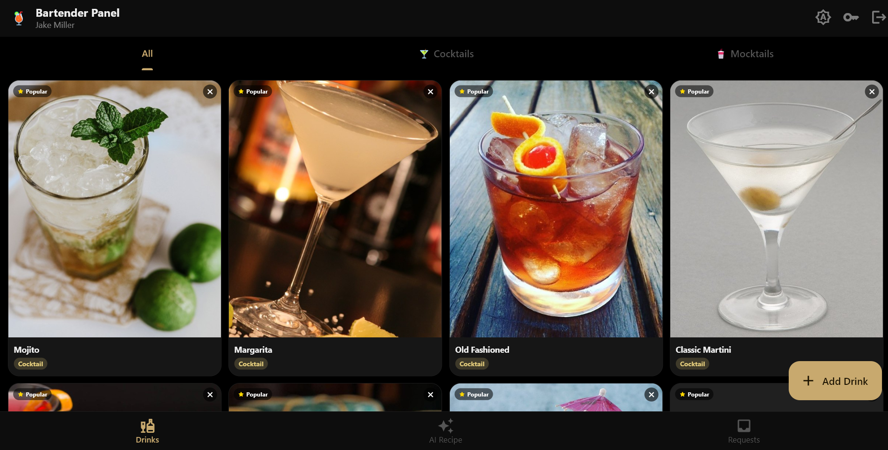

### AI Recipe with Save Option
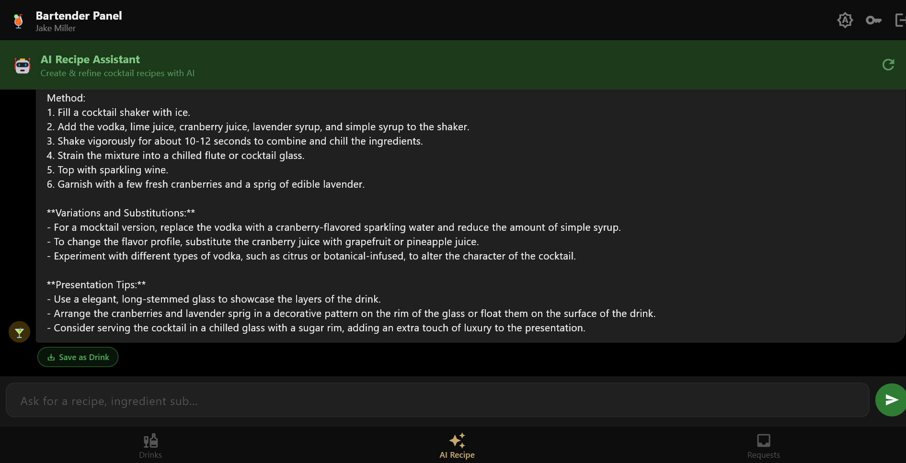

### AI Name Suggestion
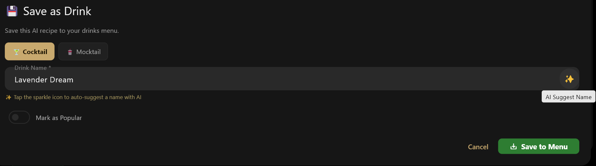

### Bartender Requests
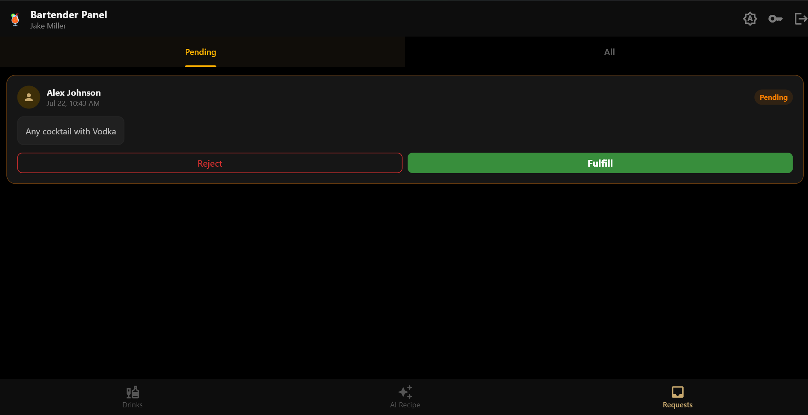

---

## 👨‍💼 Admin

### Admin Dashboard
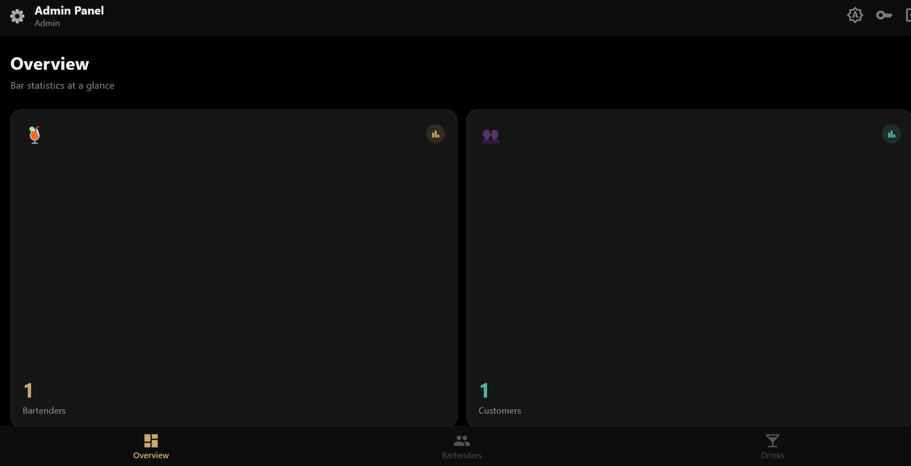

### Add Bartender
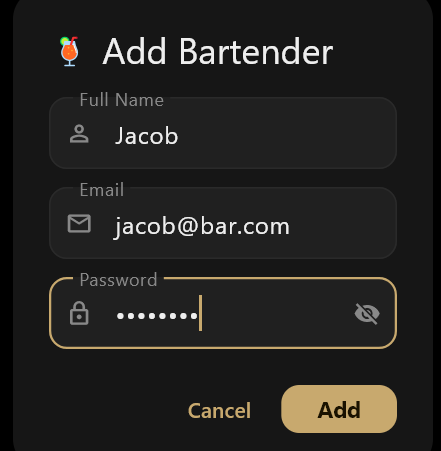

## Contributing

Fork the repo, create a focused branch, and open a pull request with a clear summary and screenshots when UI changes are involved.
